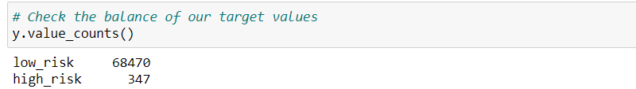
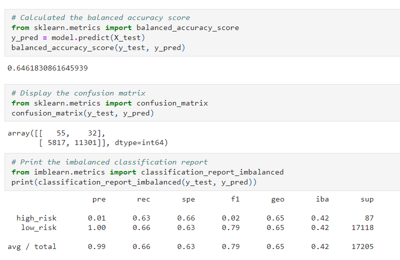
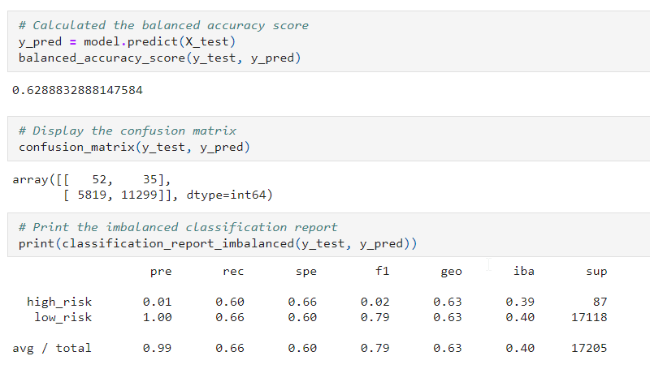
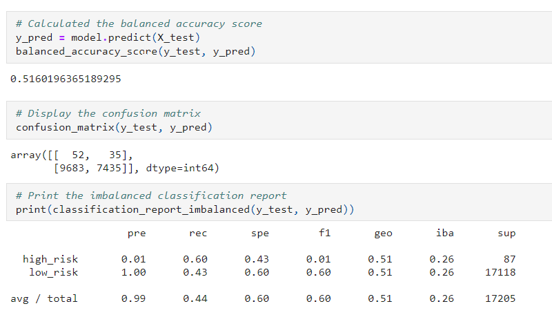
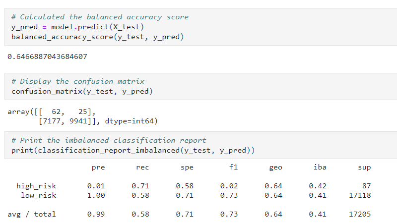
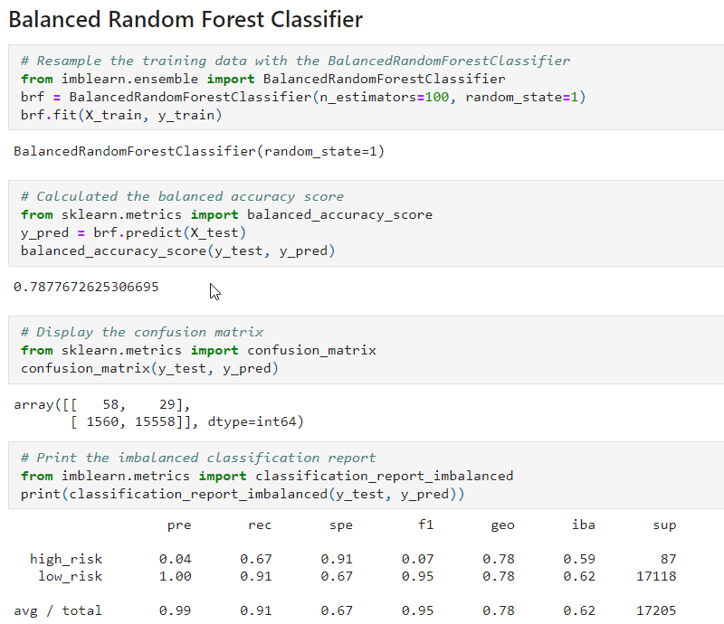
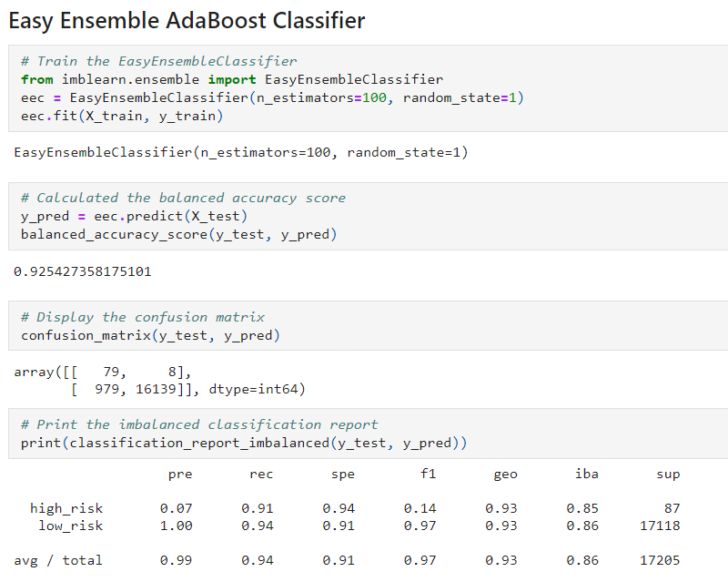

# Credit_Risk_Analysis

## Overview

Fast lending is a peer to peer lending company whose management wants to use machine learning to provide a quick and reliable way to predict credit risk. It hopes that machine learning will lead to accurate identification of good candidates for the loans and low default rates.  

### Purpose
The purpose of this analysis is to run the credit card credit dataset (obtained from Lending Club) through multiple machine learning models to determine which model best fits the data, reduces bias and predicts credit risk. 

## Analysis

Data Source: 
- Credit Card Credit Dataset from LendingClub

Software used: 
- Python Libraries (imbalanced-learn, scikit-learn)
- Jupyter Notebooks

Analysis Code: 
* [Resampling Models to Predict Credit Risk](credit_risk_resampling.ipynb)
* [Ensemble Classifiers to Predict Credit Risk](credit-risk_ensemble.ipynb)

## Results 

As expected, there was imbalance between the classes. The low-risk loans make up about 99.5% of the dataset, leaving high-risk loans at 0.5% of the dataset.

The following are the results for the algorithms that were used to resample data and generate accuracy, precision and recall scores.

### Oversampling with RandomOverSampler

* Balanced Accuracy Score - The balanced accuracy score for this model is 0.64 or 64%.
* Precision Score - The precision score for predicting low risk loans is 1.00 or 100% and predicting high risk loan is 0.01 or 1%.
* Recall Score - The recall or sensitivity score for this model is 0.66 or 66% for low risk and 0.63 or 63% for high risk loans. 

### Oversampling with SMOTE

* Balanced Accuracy Score - The balanced accuracy score for this model is 0.62 or 62%.
* Precision Score - The precision score for predicting low risk loans is 1.00 or 100% and predicting high risk loan is 0.01 or 1%.
* Recall Score - The recall or sensitivity score for this model is 0.66 or 66% for low risk and 0.60 or 60% for high risk loans. 

### Undersampling with ClusterCentroids

* Balanced Accuracy Score - The balanced accuracy score for this model is 0.51 or 51%.
* Precision Score - The precision score for predicting low risk loans is 1.00 or 100% and predicting high risk loan is 0.01 or 1%.
* Recall Score - The recall or sensitivity score for this model is 0.43 or 43% for low risk and 0.60 or 60% for high risk loans.

### Combinatorial over- and undersampling with SMOTEENN

* Balanced Accuracy Score - The balanced accuracy score for this model is 0.64 or 64%.
* Precision Score - The precision score for predicting low risk loans is 1.00 or 100% and predicting high risk loan is 0.01 or 1%.
* Recall Score - The recall or sensitivity score for this model is 0.58 or 58% for low risk and 0.71 or 71% for high risk loans.

### Resampling with BalancedRandomForestClassifier

* Balanced Accuracy Score - The balanced accuracy score for this model is 0.78 or 78%.
* Precision Score - The precision score for predicting low risk loans is 1.00 or 100% and predicting high risk loan is 0.04 or 4%.
* Recall Score - The recall or sensitivity score for this model is 0.91 or 91% for low risk and 0.67 or 67% for high risk loans.

### Resampling with EasyEnsembleClassifier

* Balanced Accuracy Score - The balanced accuracy score for this model is 0.92 or 92%.
* Precision Score - The precision score for predicting low risk loans is 1.00 or 100% and predicting high risk loan is 0.07 or 7%.
* Recall Score - The recall or sensitivity score for this model is 0.94 or 94% for low risk and 0.91 or 91% for high risk loans.

## Summary

Before determining which model best works for this dataset, its important to think about the question at hand and what is the goal of the company. The management at Fast Lending wants to use machine learning to provide accurate identification of good candidates and wants to lower the default rates.
 
Although all the models do a great job at detecting the low risk candidates with 100% precision, there is a risk resulting in number of false positivies which will allow high risk candidates to be identified as low risk and result in higher default rates. The precision scores for identifying high risk candidates range from 0.01 to 0.07 for the models. None of the above models are sucessful at accurately identifying high risk candidates and therefore none of these models are a good fit for our purpose.

  

